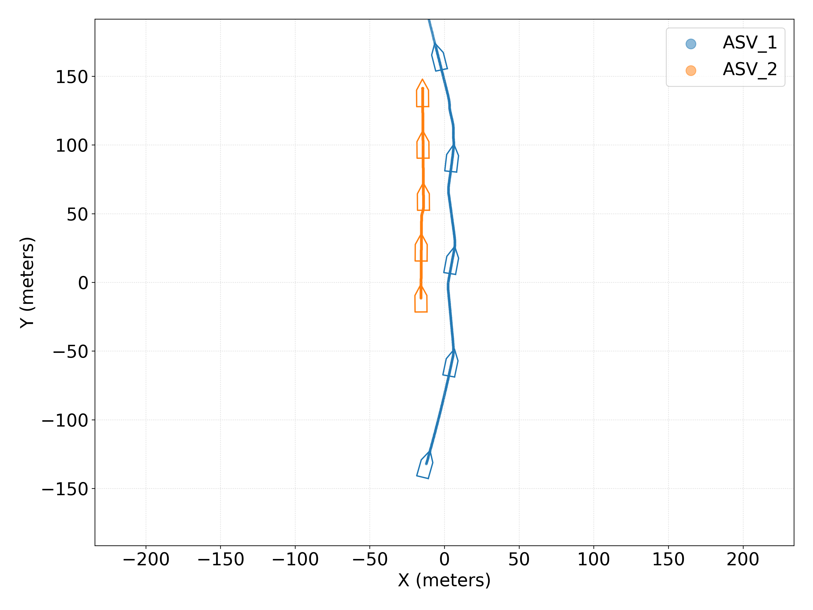
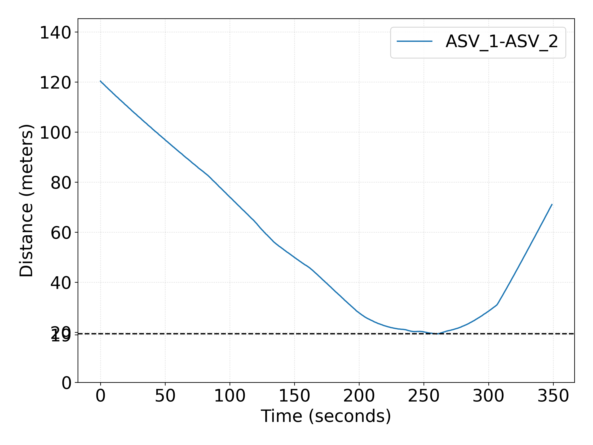
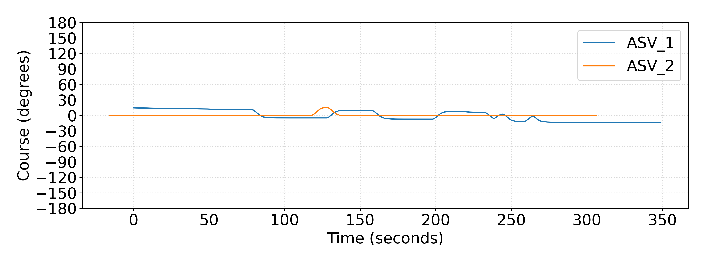
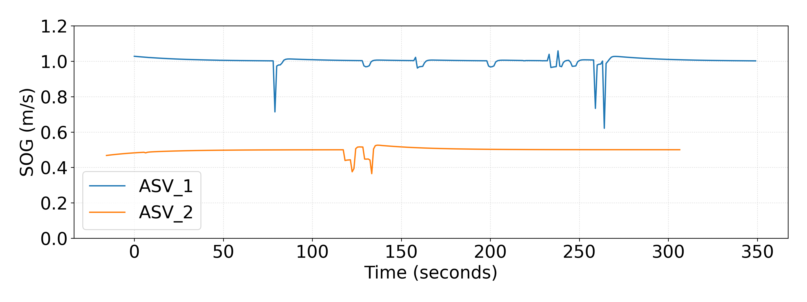

# Simulation Result:

https://github.com/user-attachments/assets/70581089-afaa-40d4-9225-90dc88e49b2f

ASV positions plot:

  <figure>
    
  </figure>

---

ASV distances plot:

  <figure>
    
  </figure>

---

ASV Course Over Grounds (COG) plot: 

  <figure>
    
  </figure>

---

ASV Speed Over Grounds (SOG) plot:

  <figure>
    
  </figure>

