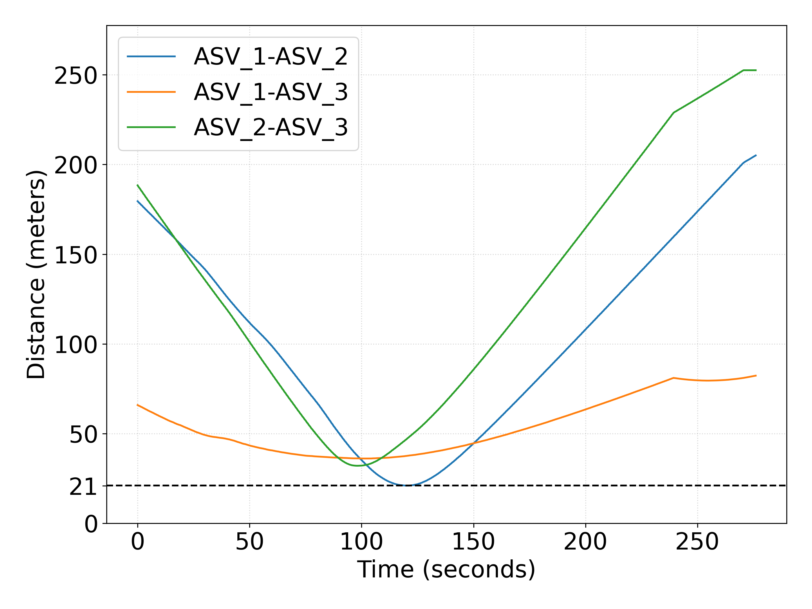
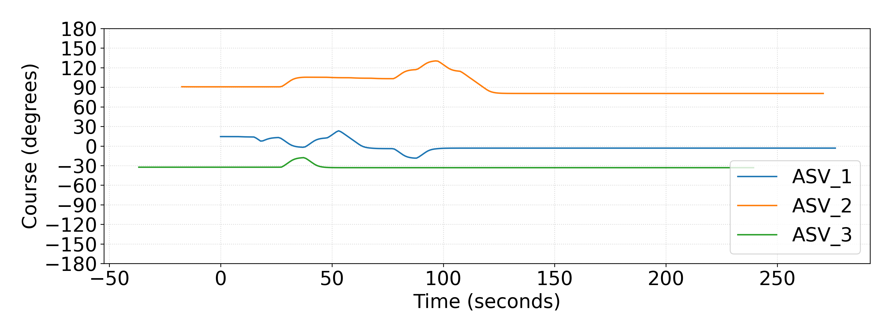

# Simulation Result:

https://github.com/user-attachments/assets/a8057ffb-8646-4d9a-b419-45e97d0c6c5d

ASV positions plot:

  <figure>
    
  </figure>

---

ASV distances plot:

  <figure>
    
  </figure>

---

ASV Course Over Grounds (COG) plot: 

  <figure>
    
  </figure>

---

ASV Speed Over Grounds (SOG) plot:

  <figure>
    
  </figure>

