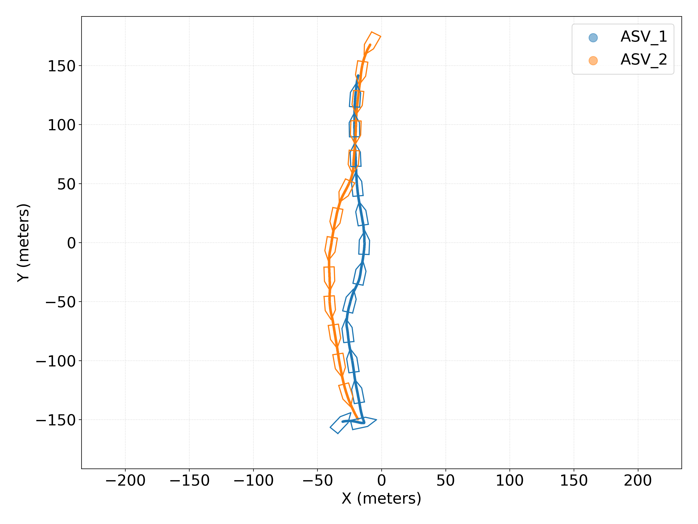
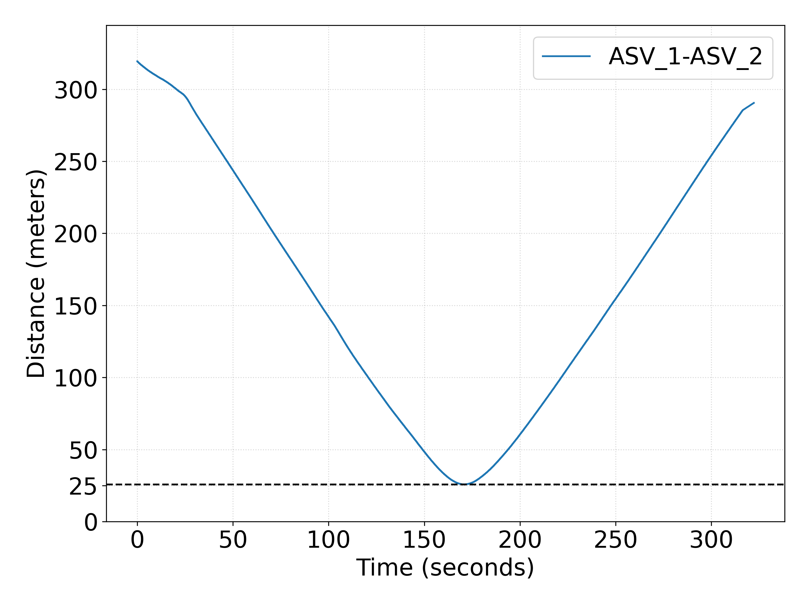
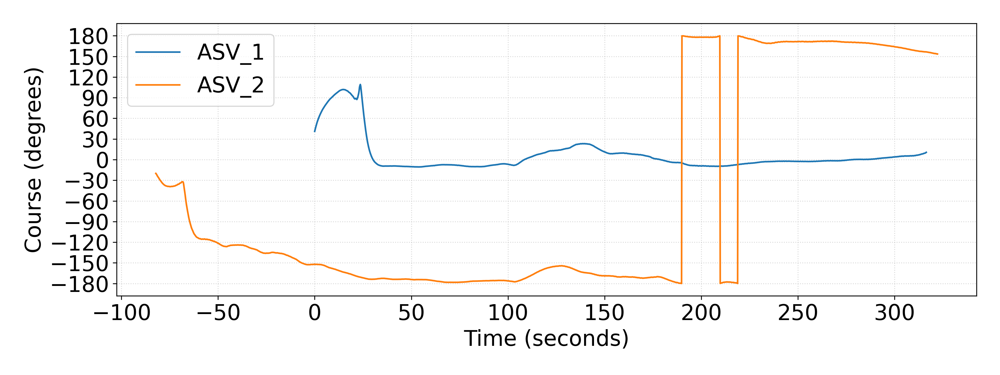
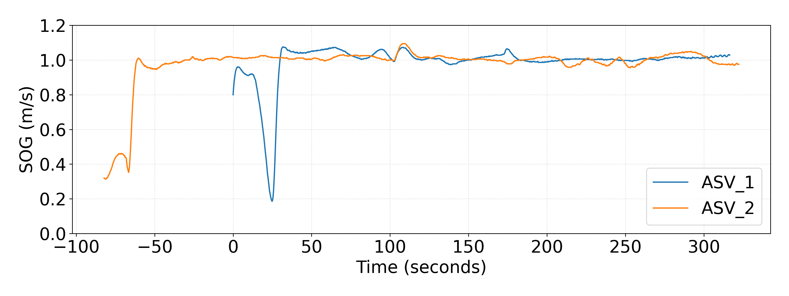
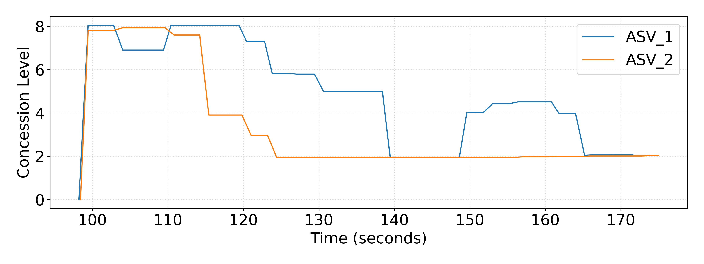
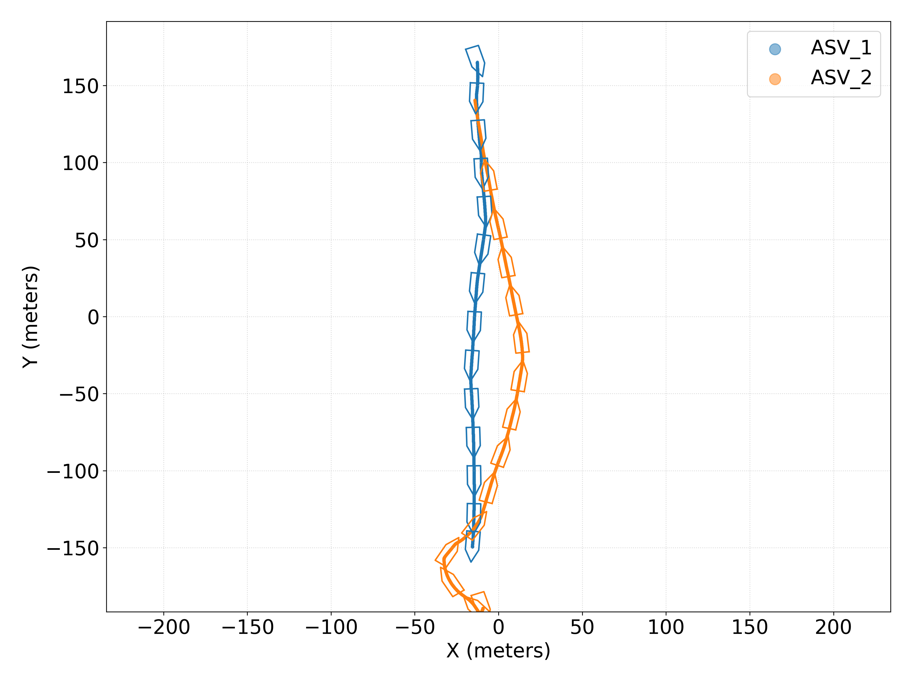
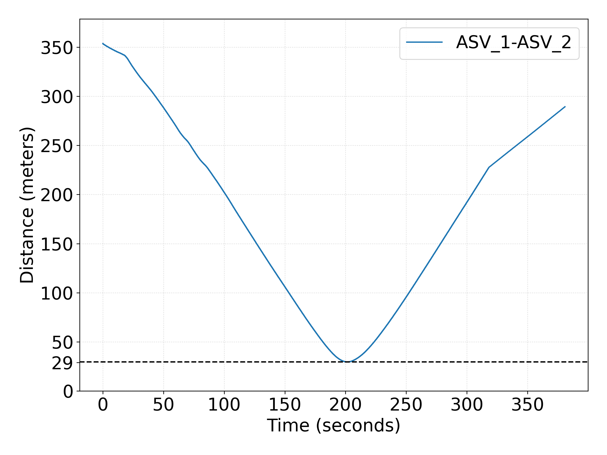
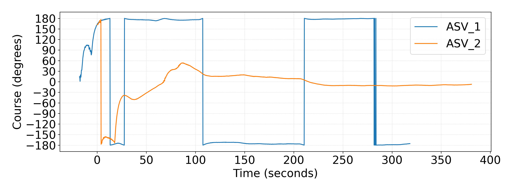
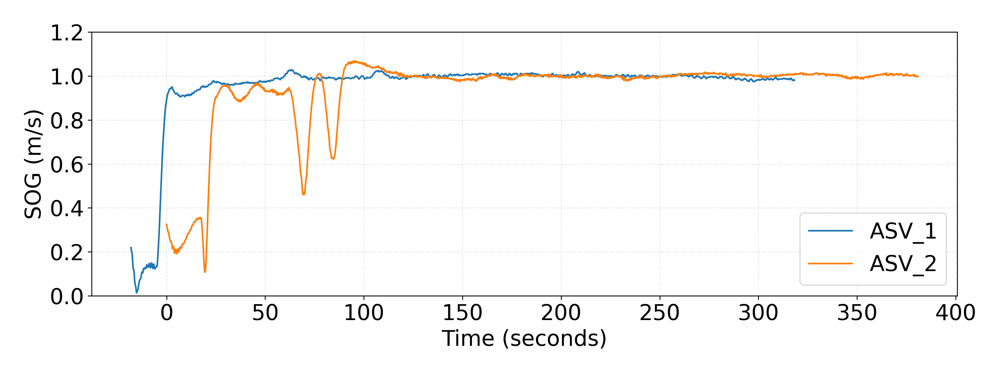
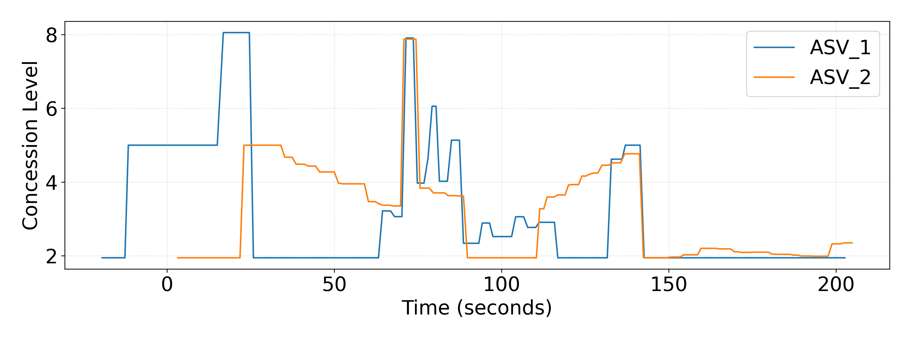

# Field Test Results: Scenario 1

## 1. Collaborative Collision Avoidance with Homogenous Vessels

ASV positions plot:

  <figure>
    
  </figure>

ASV position plots animation:

<video controls width="500">
  <source src="01_CollabHomogen/01/scenario_animation_xy_coord.mp4" type="video/mp4">  
</video>

<video src="01_CollabHomogen/01/scenario_animation_xy_coord.mp4" width=180>

https://github.com/user-attachments/assets/2ea4f1a1-ff3f-4b38-adce-2bf5d8fb951a

ASV distances plot:

  <figure>
    
  </figure>

ASV Course Over Grounds (COG) plot: 

  <figure>
    
  </figure>

ASV Speed Over Grounds (SOG) plot:

  <figure>
    
  </figure>

ASV concession levels plot:

  <figure>
    
  </figure>

---

## 2. Collaborative Collision Avoidance with Heterogeneous Vessels

ASV positions plot:

  <figure>
    
  </figure>

ASV position plots animation:

<video controls width="500">
  <source src="02_CollabHeterogen/01/scenario_animation_xy_coord.mp4" type="video/mp4">  
</video>

ASV distances plot:

  <figure>
    
  </figure>

ASV Course Over Grounds (COG) plot: 

  <figure>
    
  </figure>

ASV Speed Over Grounds (SOG) plot:

  <figure>
    
  </figure>

ASV concession levels plot:

  <figure>
    
  </figure>

