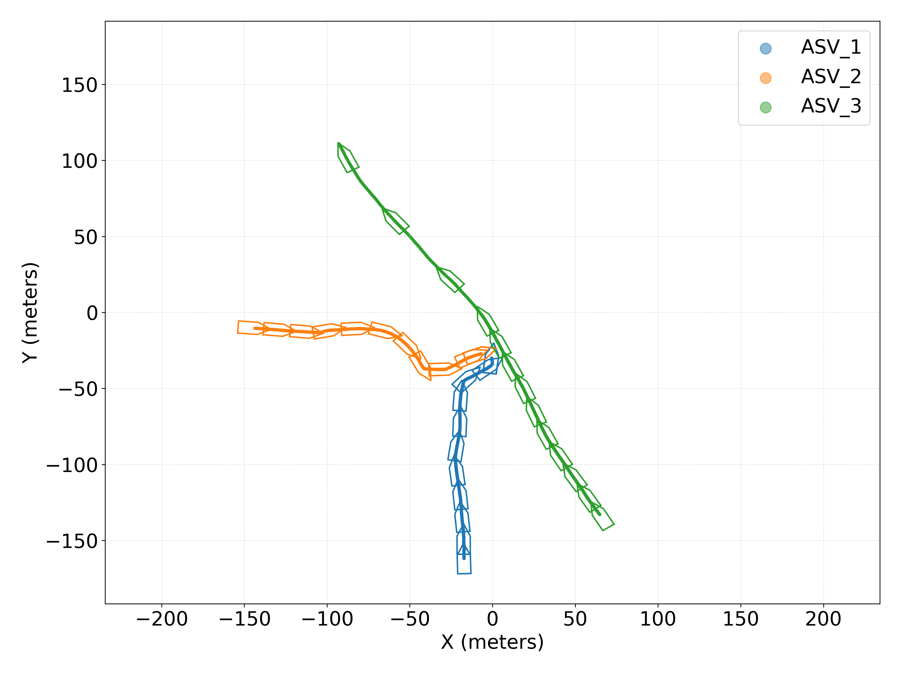
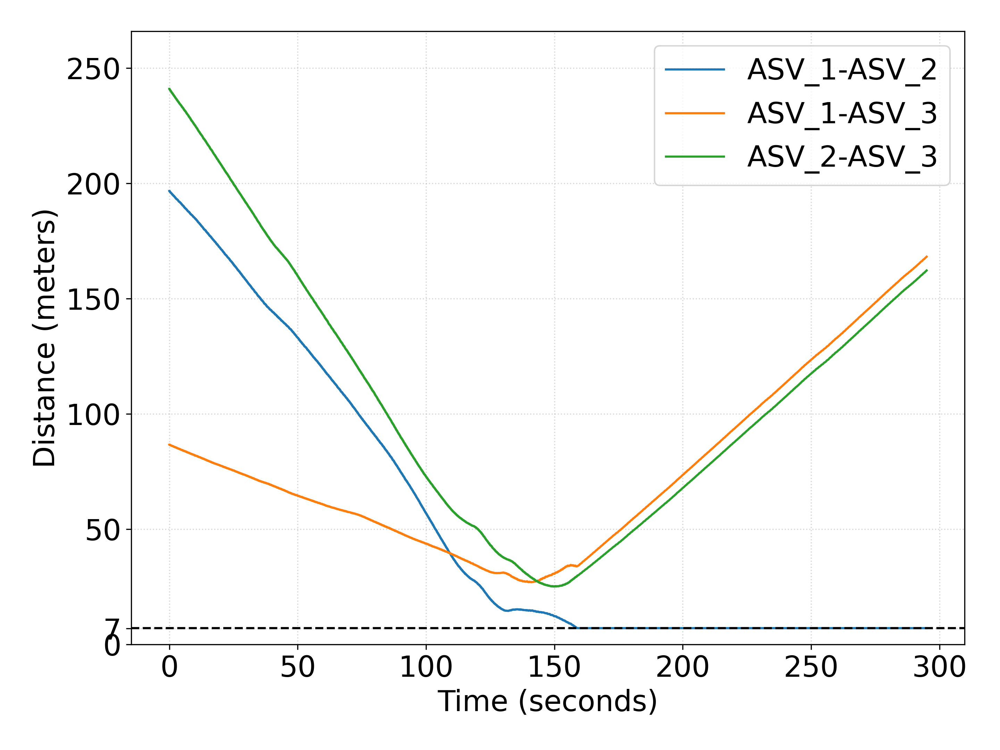
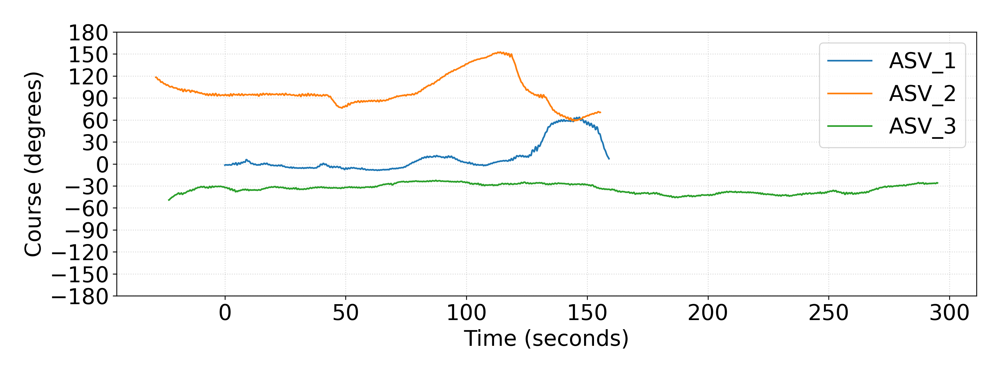
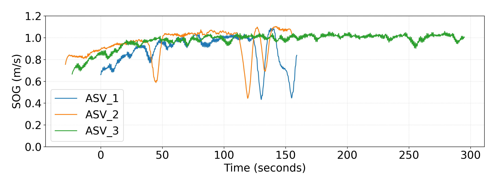
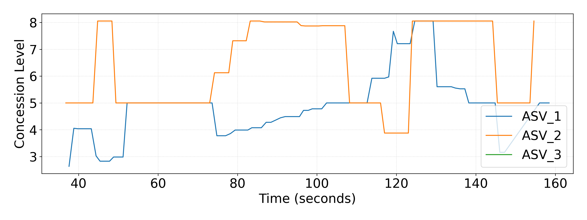

# Field Test Result:

https://github.com/user-attachments/assets/2067908f-79b3-4da9-9a93-8e33de42c847

ASV positions plot:

  <figure>
    
  </figure>

---

ASV distances plot:

  <figure>
    
  </figure>

---

ASV Course Over Grounds (COG) plot: 

  <figure>
    
  </figure>

---

ASV Speed Over Grounds (SOG) plot:

  <figure>
    
  </figure>

---

ASV concession levels plot:

  <figure>
    
  </figure>

