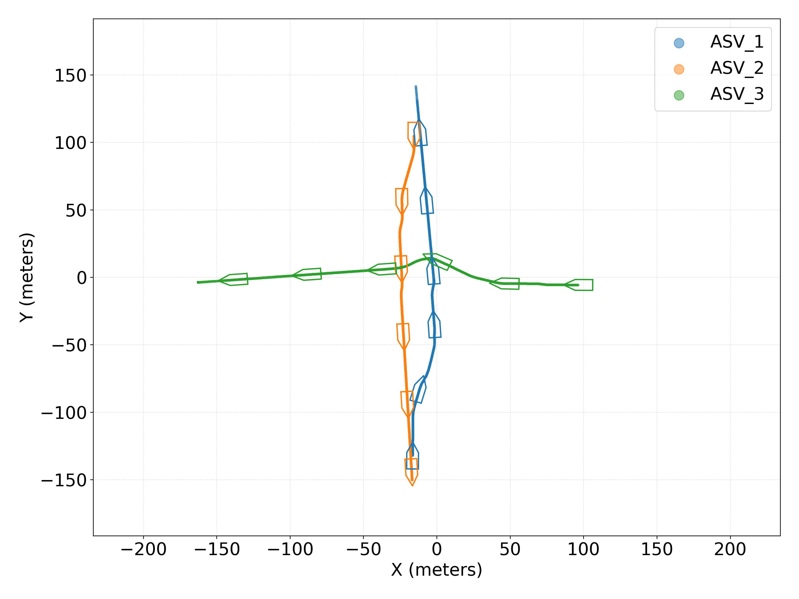

# Decentralized Negotiation Protocol for Collaborative Collision Avoidance of ASVs
Simulation and field test results of the paper called "A Decentralized Negotiation Protocol for Collaborative Collision Avoidance of Autonomous Surface Vehicles".

---

## Table of Contents
1. [Simulation results](#01_simulation_results)
2. [Field test results](#02_field_test_results)

---

## Simulation results

  <table style="width: 100%; border-collapse: collapse; table-layout: fixed;">
    <!-- Scenario 1: Definition -->
    <tr>
      <td style="text-align: center; vertical-align: middle;">
        <a href="https://github.com/MelihAkdag/Decentralized-Negotiation-Protocol-for-Collaborative-Collision-Avoidance-of-ASVs-Results/tree/main/00_scenario_definitions" target="_blank">
          
          
<em>Scenario 1: SB-MPC without collaboration.</em>

        </a>
      </td>
      <td style="text-align: center; vertical-align: middle;">
        <a href="https://github.com/MelihAkdag/Decentralized-Negotiation-Protocol-for-Collaborative-Collision-Avoidance-of-ASVs-Results/tree/main/00_scenario_definitions" target="_blank">
          
          
<em>Scenario 1: Collaborative homogenous vessels (collaborative SB-MPC).</em>

        </a>
      </td>
      <td style="text-align: center; vertical-align: middle;">
        <a href="https://github.com/MelihAkdag/Decentralized-Negotiation-Protocol-for-Collaborative-Collision-Avoidance-of-ASVs-Results/tree/main/00_scenario_definitions" target="_blank">
          
          
<em>Scenario 1: Collaborative heterogenous vessels (collaborative SB-MPC and RVO).</em>

        </a>
      </td>
    </tr>
    <!-- Scenario 1: Results -->
    <tr>
      <td style="text-align: center; vertical-align: middle;">
        <a href="https://github.com/MelihAkdag/Decentralized-Negotiation-Protocol-for-Collaborative-Collision-Avoidance-of-ASVs-Results/tree/main/01_simulation_results/Scenario01/01_Benchmark_SBMPC_without_collab" target="_blank">
          
          
<em>Click for more results.</em>

        </a>
      </td>
      <td style="text-align: center; vertical-align: middle;">
        <a href="https://github.com/MelihAkdag/Decentralized-Negotiation-Protocol-for-Collaborative-Collision-Avoidance-of-ASVs-Results/tree/main/01_simulation_results/Scenario01/02_CollabHomogen" target="_blank">
          
          
<em>Click for more results.</em>

        </a>
      </td>
      <td style="text-align: center; vertical-align: middle;">
        <a href="https://github.com/MelihAkdag/Decentralized-Negotiation-Protocol-for-Collaborative-Collision-Avoidance-of-ASVs-Results/tree/main/01_simulation_results/Scenario01/03_CollabHeterogen" target="_blank">
          
          
<em>Click for more results.</em>

        </a>
      </td>
    </tr>
    <!-- Scenario 2: Definition -->
    <tr>
      <td style="text-align: center; vertical-align: middle;">
        <a href="https://github.com/MelihAkdag/Decentralized-Negotiation-Protocol-for-Collaborative-Collision-Avoidance-of-ASVs-Results/tree/main/00_scenario_definitions" target="_blank">
          
          
<em>Scenario 2: SB-MPC without collaboration.</em>

        </a>
      </td>
      <td style="text-align: center; vertical-align: middle;">
        <a href="https://github.com/MelihAkdag/Decentralized-Negotiation-Protocol-for-Collaborative-Collision-Avoidance-of-ASVs-Results/tree/main/00_scenario_definitions" target="_blank">
          
          
<em>Scenario 2: Collaborative homogenous vessels (collaborative SB-MPC).</em>

        </a>
      </td>
      <td style="text-align: center; vertical-align: middle;">
        <a href="https://github.com/MelihAkdag/Decentralized-Negotiation-Protocol-for-Collaborative-Collision-Avoidance-of-ASVs-Results/tree/main/00_scenario_definitions" target="_blank">
          
          
<em>Scenario 2: Collaborative heterogenous vessels (collaborative SB-MPC and RVO).</em>

        </a>
      </td>
    </tr>
    <!-- Scenario 2: Results -->
    <tr>
      <td style="text-align: center; vertical-align: middle;">
        <a href="https://github.com/MelihAkdag/Decentralized-Negotiation-Protocol-for-Collaborative-Collision-Avoidance-of-ASVs-Results/tree/main/01_simulation_results/Scenario02/01_Benchmark_SBMPC_without_collab" target="_blank">
          
          
<em>Click for more results.</em>

        </a>
      </td>
      <td style="text-align: center; vertical-align: middle;">
        <a href="https://github.com/MelihAkdag/Decentralized-Negotiation-Protocol-for-Collaborative-Collision-Avoidance-of-ASVs-Results/tree/main/01_simulation_results/Scenario02/02_CollabHomogen" target="_blank">
          
          
<em>Click for more results.</em>

        </a>
      </td>
      <td style="text-align: center; vertical-align: middle;">
        <a href="https://github.com/MelihAkdag/Decentralized-Negotiation-Protocol-for-Collaborative-Collision-Avoidance-of-ASVs-Results/tree/main/01_simulation_results/Scenario02/03_CollabHeterogen" target="_blank">
          
          
<em>Click for more results.</em>

        </a>
      </td>
    </tr>
    <!-- Scenario 3: Definition -->
    <tr>
      <td style="text-align: center; vertical-align: middle;">
        <a href="https://github.com/MelihAkdag/Decentralized-Negotiation-Protocol-for-Collaborative-Collision-Avoidance-of-ASVs-Results/tree/main/00_scenario_definitions" target="_blank">
          
          
<em>Scenario 3: SB-MPC without collaboration.</em>

        </a>
      </td>
      <td style="text-align: center; vertical-align: middle;">
        <a href="https://github.com/MelihAkdag/Decentralized-Negotiation-Protocol-for-Collaborative-Collision-Avoidance-of-ASVs-Results/tree/main/00_scenario_definitions" target="_blank">
          
          
<em>Scenario 3: Collaborative homogenous vessels (collaborative SB-MPC).</em>

        </a>
      </td>
      <td style="text-align: center; vertical-align: middle;">
        <a href="https://github.com/MelihAkdag/Decentralized-Negotiation-Protocol-for-Collaborative-Collision-Avoidance-of-ASVs-Results/tree/main/00_scenario_definitions" target="_blank">
          
          
<em>Scenario 3: Collaborative heterogenous vessels (collaborative SB-MPC and RVO).</em>

        </a>
      </td>
    </tr>
    <!-- Scenario 3: Results -->
    <tr>
      <td style="text-align: center; vertical-align: middle;">
        <a href="https://github.com/MelihAkdag/Decentralized-Negotiation-Protocol-for-Collaborative-Collision-Avoidance-of-ASVs-Results/tree/main/01_simulation_results/Scenario03/01_Benchmark_SBMPC_without_collab" target="_blank">
          
          
<em>Click for more results.</em>

        </a>
      </td>
      <td style="text-align: center; vertical-align: middle;">
        <a href="https://github.com/MelihAkdag/Decentralized-Negotiation-Protocol-for-Collaborative-Collision-Avoidance-of-ASVs-Results/tree/main/01_simulation_results/Scenario03/02_CollabHomogen" target="_blank">
          
          
<em>Click for more results.</em>

        </a>
      </td>
      <td style="text-align: center; vertical-align: middle;">
        <a href="https://github.com/MelihAkdag/Decentralized-Negotiation-Protocol-for-Collaborative-Collision-Avoidance-of-ASVs-Results/tree/main/01_simulation_results/Scenario03/03_CollabHeterogen" target="_blank">
          
          
<em>Click for more results.</em>

        </a>
      </td>
    </tr>
    <!-- Scenario 4: Definition -->
    <tr>
      <td style="text-align: center; vertical-align: middle;">
        <a href="https://github.com/MelihAkdag/Decentralized-Negotiation-Protocol-for-Collaborative-Collision-Avoidance-of-ASVs-Results/tree/main/00_scenario_definitions" target="_blank">
          
          
<em>Scenario 4: SB-MPC without collaboration.</em>

        </a>
      </td>
      <td style="text-align: center; vertical-align: middle;">
        <a href="https://github.com/MelihAkdag/Decentralized-Negotiation-Protocol-for-Collaborative-Collision-Avoidance-of-ASVs-Results/tree/main/00_scenario_definitions" target="_blank">
          
          
<em>Scenario 4: Collaborative homogenous vessels (collaborative SB-MPC).</em>

        </a>
      </td>
      <td style="text-align: center; vertical-align: middle;">
        <a href="https://github.com/MelihAkdag/Decentralized-Negotiation-Protocol-for-Collaborative-Collision-Avoidance-of-ASVs-Results/tree/main/00_scenario_definitions" target="_blank">
          
          
<em>Scenario 4: Collaborative heterogenous vessels (collaborative SB-MPC and RVO).</em>

        </a>
      </td>
    </tr>
    <!-- Scenario 4: Results -->
    <tr>
      <td style="text-align: center; vertical-align: middle;">
        <a href="https://github.com/MelihAkdag/Decentralized-Negotiation-Protocol-for-Collaborative-Collision-Avoidance-of-ASVs-Results/tree/main/01_simulation_results/Scenario04/01_Benchmark_SBMPC_without_collab" target="_blank">
          
          
<em>Click for more results.</em>

        </a>
      </td>
      <td style="text-align: center; vertical-align: middle;">
        <a href="https://github.com/MelihAkdag/Decentralized-Negotiation-Protocol-for-Collaborative-Collision-Avoidance-of-ASVs-Results/tree/main/01_simulation_results/Scenario04/02_CollabHomogen" target="_blank">
          
          
<em>Click for more results.</em>

        </a>
      </td>
      <td style="text-align: center; vertical-align: middle;">
        <a href="https://github.com/MelihAkdag/Decentralized-Negotiation-Protocol-for-Collaborative-Collision-Avoidance-of-ASVs-Results/tree/main/01_simulation_results/Scenario04/03_CollabHeterogen" target="_blank">
          
          
<em>Click for more results.</em>

        </a>
      </td>
    </tr>
    <!-- Scenario 5: Definition -->
    <tr>
      <td style="text-align: center; vertical-align: middle;">
        <a href="https://github.com/MelihAkdag/Decentralized-Negotiation-Protocol-for-Collaborative-Collision-Avoidance-of-ASVs-Results/tree/main/00_scenario_definitions" target="_blank">
          
          
<em>Scenario 5: SB-MPC without collaboration.</em>

        </a>
      </td>
      <td style="text-align: center; vertical-align: middle;">
        <a href="https://github.com/MelihAkdag/Decentralized-Negotiation-Protocol-for-Collaborative-Collision-Avoidance-of-ASVs-Results/tree/main/00_scenario_definitions" target="_blank">
          
          
<em>Scenario 5: Collaborative homogenous vessels (collaborative SB-MPC).</em>

        </a>
      </td>
      <td style="text-align: center; vertical-align: middle;">
        <a href="https://github.com/MelihAkdag/Decentralized-Negotiation-Protocol-for-Collaborative-Collision-Avoidance-of-ASVs-Results/tree/main/00_scenario_definitions" target="_blank">
          
          
<em>Scenario 5: Collaborative heterogenous vessels (collaborative SB-MPC and RVO).</em>

        </a>
      </td>
    </tr>
    <!-- Scenario 5: Results -->
    <tr>
      <td style="text-align: center; vertical-align: middle;">
        <a href="https://github.com/MelihAkdag/Decentralized-Negotiation-Protocol-for-Collaborative-Collision-Avoidance-of-ASVs-Results/tree/main/01_simulation_results/Scenario05/01_Benchmark_SBMPC_without_collab" target="_blank">
          
          
<em>Click for more results.</em>

        </a>
      </td>
      <td style="text-align: center; vertical-align: middle;">
        <a href="https://github.com/MelihAkdag/Decentralized-Negotiation-Protocol-for-Collaborative-Collision-Avoidance-of-ASVs-Results/tree/main/01_simulation_results/Scenario05/02_CollabHomogen" target="_blank">
          
          
<em>Click for more results.</em>

        </a>
      </td>
      <td style="text-align: center; vertical-align: middle;">
        <a href="https://github.com/MelihAkdag/Decentralized-Negotiation-Protocol-for-Collaborative-Collision-Avoidance-of-ASVs-Results/tree/main/01_simulation_results/Scenario05/03_CollabHeterogen" target="_blank">
          
          
<em>Click for more results.</em>

        </a>
      </td>
    </tr>
    <!-- Scenario 5/6: Definition -->
    <tr>
      <td style="text-align: center; vertical-align: middle;">
        <a href="https://github.com/MelihAkdag/Decentralized-Negotiation-Protocol-for-Collaborative-Collision-Avoidance-of-ASVs-Results/tree/main/00_scenario_definitions" target="_blank">
          
          
<em>Scenario 5: Collaborative and non-collaborative collision avoidance between heterogenous vesses (SB-MPC, RVO, and SB-MPC (without collab)).</em>

        </a>
      </td>
      <td style="text-align: center; vertical-align: middle;">
        <a href="https://github.com/MelihAkdag/Decentralized-Negotiation-Protocol-for-Collaborative-Collision-Avoidance-of-ASVs-Results/tree/main/00_scenario_definitions" target="_blank">
          
          
<em>Scenario 5: Collaborative collision avoidance between heterogenous vesses with non-cooperative vessel in the environment (SB-MPC, RVO, and non-coop. vessel).</em>

        </a>
      </td>
      <td style="text-align: center; vertical-align: middle;">
        <a href="https://github.com/MelihAkdag/Decentralized-Negotiation-Protocol-for-Collaborative-Collision-Avoidance-of-ASVs-Results/tree/main/00_scenario_definitions" target="_blank">
          
          
<em>Scenario 6: Mixed scenario (collab SB-MPC, collab RVO, non-collab SB-MPC, and non-coop vessels).</em>

        </a>
      </td>
    </tr>
    <!-- Scenario 5/6: Results -->
    <tr>
      <td style="text-align: center; vertical-align: middle;">
        <a href="https://github.com/MelihAkdag/Decentralized-Negotiation-Protocol-for-Collaborative-Collision-Avoidance-of-ASVs-Results/tree/main/01_simulation_results/Scenario05/04_CollabAndNonCollabHeterogen" target="_blank">
          
          
<em>Click for more results.</em>

        </a>
      </td>
      <td style="text-align: center; vertical-align: middle;">
        <a href="https://github.com/MelihAkdag/Decentralized-Negotiation-Protocol-for-Collaborative-Collision-Avoidance-of-ASVs-Results/tree/main/01_simulation_results/Scenario05/05_CollabAndNonCoopHeterogen" target="_blank">
          
          
<em>Click for more results.</em>

        </a>
      </td>
      <td style="text-align: center; vertical-align: middle;">
        <a href="https://github.com/MelihAkdag/Decentralized-Negotiation-Protocol-for-Collaborative-Collision-Avoidance-of-ASVs-Results/tree/main/01_simulation_results/Scenario06/01_CollabAndNonCoopHeterogen" target="_blank">
          
          
<em>Click for more results.</em>

        </a>
      </td>
    </tr>
  </table>

---

## Field test results

  <table style="width: 100%; border-collapse: collapse; table-layout: fixed;">
    <!-- Scenario 1: Definition -->
    <tr>
      <td style="text-align: center; vertical-align: middle;">
        <a href="https://github.com/MelihAkdag/Decentralized-Negotiation-Protocol-for-Collaborative-Collision-Avoidance-of-ASVs-Results/tree/main/00_scenario_definitions" target="_blank">
          
          
<em>Scenario 1: Collaborative homogenous vessels (collaborative SB-MPC).</em>

        </a>
      </td>
      <td style="text-align: center; vertical-align: middle;">
        <a href="https://github.com/MelihAkdag/Decentralized-Negotiation-Protocol-for-Collaborative-Collision-Avoidance-of-ASVs-Results/tree/main/00_scenario_definitions" target="_blank">
          
          
<em>Scenario 1: Collaborative heterogenous vessels (collaborative SB-MPC and RVO).</em>

        </a>
      </td>
    </tr>
    <!-- Scenario 1: Results -->
    <tr>
      <td style="text-align: center; vertical-align: middle;">
        <a href="https://github.com/MelihAkdag/Decentralized-Negotiation-Protocol-for-Collaborative-Collision-Avoidance-of-ASVs-Results/tree/main/02_field_test_results/Scenario01/01_CollabHomogen/01" target="_blank">
          
          
<em>Click for more results.</em>

        </a>
      </td>
      <td style="text-align: center; vertical-align: middle;">
        <a href="https://github.com/MelihAkdag/Decentralized-Negotiation-Protocol-for-Collaborative-Collision-Avoidance-of-ASVs-Results/tree/main/02_field_test_results/Scenario01/02_CollabHeterogen/01" target="_blank">
          
          
<em>Click for more results.</em>

        </a>
      </td>
    </tr>
    <!-- Scenario 2: Definition -->
    <tr>
      <td style="text-align: center; vertical-align: middle;">
        <a href="https://github.com/MelihAkdag/Decentralized-Negotiation-Protocol-for-Collaborative-Collision-Avoidance-of-ASVs-Results/tree/main/00_scenario_definitions" target="_blank">
          
          
<em>Scenario 2: Collaborative homogenous vessels (collaborative SB-MPC).</em>

        </a>
      </td>
      <td style="text-align: center; vertical-align: middle;">
        <a href="https://github.com/MelihAkdag/Decentralized-Negotiation-Protocol-for-Collaborative-Collision-Avoidance-of-ASVs-Results/tree/main/00_scenario_definitions" target="_blank">
          
          
<em>Scenario 2: Collaborative heterogenous vessels (collaborative SB-MPC and RVO).</em>

        </a>
      </td>
    </tr>
    <!-- Scenario 2: Results -->
    <tr>
      <td style="text-align: center; vertical-align: middle;">
        <a href="https://github.com/MelihAkdag/Decentralized-Negotiation-Protocol-for-Collaborative-Collision-Avoidance-of-ASVs-Results/tree/main/02_field_test_results/Scenario02/01_CollabHomogen/01" target="_blank">
          
          
<em>Click for more results.</em>

        </a>
      </td>
      <td style="text-align: center; vertical-align: middle;">
        <a href="https://github.com/MelihAkdag/Decentralized-Negotiation-Protocol-for-Collaborative-Collision-Avoidance-of-ASVs-Results/tree/main/02_field_test_results/Scenario02/02_CollabHeterogen" target="_blank">
          
          
<em>Click for more results.</em>

        </a>
      </td>
    </tr>
    <!-- Scenario 3: Definition -->
    <tr>
      <td style="text-align: center; vertical-align: middle;">
        <a href="https://github.com/MelihAkdag/Decentralized-Negotiation-Protocol-for-Collaborative-Collision-Avoidance-of-ASVs-Results/tree/main/00_scenario_definitions" target="_blank">
          
          
<em>Scenario 3: Collaborative homogenous vessels (collaborative SB-MPC).</em>

        </a>
      </td>
      <td style="text-align: center; vertical-align: middle;">
        <a href="https://github.com/MelihAkdag/Decentralized-Negotiation-Protocol-for-Collaborative-Collision-Avoidance-of-ASVs-Results/tree/main/00_scenario_definitions" target="_blank">
          
          
<em>Scenario 3: Collaborative heterogenous vessels (collaborative SB-MPC and RVO).</em>

        </a>
      </td>
    </tr>
    <!-- Scenario 3: Results -->
    <tr>
      <td style="text-align: center; vertical-align: middle;">
        <a href="https://github.com/MelihAkdag/Decentralized-Negotiation-Protocol-for-Collaborative-Collision-Avoidance-of-ASVs-Results/tree/main/02_field_test_results/Scenario03/01_CollabHomogen/01" target="_blank">
          
          
<em>Click for more results.</em>

        </a>
      </td>
      <td style="text-align: center; vertical-align: middle;">
        <a href="https://github.com/MelihAkdag/Decentralized-Negotiation-Protocol-for-Collaborative-Collision-Avoidance-of-ASVs-Results/tree/main/02_field_test_results/Scenario03/02_CollabHeterogen" target="_blank">
          
          
<em>Click for more results.</em>

        </a>
      </td>
    </tr>
    <!-- Scenario 4: Definition -->
    <tr>
      <td style="text-align: center; vertical-align: middle;">
        <a href="https://github.com/MelihAkdag/Decentralized-Negotiation-Protocol-for-Collaborative-Collision-Avoidance-of-ASVs-Results/tree/main/00_scenario_definitions" target="_blank">
          
          
<em>Scenario 4: Collaborative homogenous vessels (collaborative SB-MPC).</em>

        </a>
      </td>
      <td style="text-align: center; vertical-align: middle;">
        <a href="https://github.com/MelihAkdag/Decentralized-Negotiation-Protocol-for-Collaborative-Collision-Avoidance-of-ASVs-Results/tree/main/00_scenario_definitions" target="_blank">
          
          
<em>Scenario 4: Collaborative heterogenous vessels (collaborative SB-MPC and RVO).</em>

        </a>
      </td>
    </tr>
    <!-- Scenario 4: Results -->
    <tr>
      <td style="text-align: center; vertical-align: middle;">
        <a href="https://github.com/MelihAkdag/Decentralized-Negotiation-Protocol-for-Collaborative-Collision-Avoidance-of-ASVs-Results/tree/main/02_field_test_results/Scenario04/01_CollabHomogen/01" target="_blank">
          
          
<em>Click for more results.</em>

        </a>
      </td>
      <td style="text-align: center; vertical-align: middle;">
        <a href="https://github.com/MelihAkdag/Decentralized-Negotiation-Protocol-for-Collaborative-Collision-Avoidance-of-ASVs-Results/tree/main/02_field_test_results/Scenario04/02_CollabHeterogen" target="_blank">
          
          
<em>Click for more results.</em>

        </a>
      </td>
    </tr>
    <!-- Scenario 5: Definition -->
    <tr>
      <td style="text-align: center; vertical-align: middle;">
        <a href="https://github.com/MelihAkdag/Decentralized-Negotiation-Protocol-for-Collaborative-Collision-Avoidance-of-ASVs-Results/tree/main/00_scenario_definitions" target="_blank">
          
          
<em>Scenario 5: Collaborative homogenous vessels (collaborative SB-MPC).</em>

        </a>
      </td>
      <td style="text-align: center; vertical-align: middle;">
        <a href="https://github.com/MelihAkdag/Decentralized-Negotiation-Protocol-for-Collaborative-Collision-Avoidance-of-ASVs-Results/tree/main/00_scenario_definitions" target="_blank">
          
          
<em>Scenario 5: Collaborative heterogenous vessels (collaborative SB-MPC and RVO).</em>

        </a>
      </td>
    </tr>
    <!-- Scenario 5: Results -->
    <tr>
      <td style="text-align: center; vertical-align: middle;">
        <a href="https://github.com/MelihAkdag/Decentralized-Negotiation-Protocol-for-Collaborative-Collision-Avoidance-of-ASVs-Results/tree/main/02_field_test_results/Scenario05/01_CollabHomogen/01" target="_blank">
          
          
<em>Click for more results.</em>

        </a>
      </td>
      <td style="text-align: center; vertical-align: middle;">
        <a href="https://github.com/MelihAkdag/Decentralized-Negotiation-Protocol-for-Collaborative-Collision-Avoidance-of-ASVs-Results/tree/main/02_field_test_results/Scenario05/02_CollabHeterogen/01" target="_blank">
          
          
<em>Click for more results.</em>

        </a>
      </td>
    </tr>
    <!-- Scenario 5: Definition -->
    <tr>
      <td style="text-align: center; vertical-align: middle;">
        <a href="https://github.com/MelihAkdag/Decentralized-Negotiation-Protocol-for-Collaborative-Collision-Avoidance-of-ASVs-Results/tree/main/00_scenario_definitions" target="_blank">
          
          
<em>Scenario 5: Collaborative and non-collaborative collision avoidance between heterogenous vesses (SB-MPC, RVO, and SB-MPC (without collab)).</em>

        </a>
      </td>
      <td style="text-align: center; vertical-align: middle;">
        <a href="https://github.com/MelihAkdag/Decentralized-Negotiation-Protocol-for-Collaborative-Collision-Avoidance-of-ASVs-Results/tree/main/00_scenario_definitions" target="_blank">
          
          
<em>Scenario 5: Collaborative collision avoidance between heterogenous vesses with non-cooperative vessel in the environment (SB-MPC, RVO, and non-coop. vessel).</em>

        </a>
      </td>
    </tr>
    <!-- Scenario 5: Results -->
    <tr>
      <td style="text-align: center; vertical-align: middle;">
        <a href="https://github.com/MelihAkdag/Decentralized-Negotiation-Protocol-for-Collaborative-Collision-Avoidance-of-ASVs-Results/tree/main/02_field_test_results/Scenario05/03_CollabNonCollabHeterogen" target="_blank">
          
          
<em>Click for more results.</em>

        </a>
      </td>
      <td style="text-align: center; vertical-align: middle;">
        <a href="https://github.com/MelihAkdag/Decentralized-Negotiation-Protocol-for-Collaborative-Collision-Avoidance-of-ASVs-Results/tree/main/02_field_test_results/Scenario05/04_CollabNonCoopHeterogen/01" target="_blank">
          
          
<em>Click for more results.</em>

        </a>
      </td>
    </tr>
  </table>

---

### Videos

<video controls width="500">
  <source src="01_simulation_results/Scenario01/01_Benchmark_SBMPC_without_collab/01/scenario_animation_xy_coord.mp4" type="video/mp4">  
  Your browser does not support the video tag.
</video>
*Figure 3: Description of the video.*

---

  <!-- Image 1 -->
  
  
  <!-- Video 1 -->
  <video controls width="400">
    <source src="01_simulation_results/Scenario01/01_Benchmark_SBMPC_without_collab/01/scenario_animation_xy_coord.mp4" type="video/mp4">
    Your browser does not support the video tag.
  </video>
  
  <!-- Image 2 -->
  
  

---

## Notes

- Ensure the file paths in the links correspond to your repository's structure.
- Replace placeholders like `results_folder_1/image_1.png` with the actual paths to your files.
- Markdown does not support embedding MP4 files natively on GitHub. These videos will display locally or in markdown preview tools but not in GitHub's web interface. Consider linking to a hosted version (e.g., on YouTube, Vimeo) if you need them viewable online.

---

## Contact

For any questions or issues, feel free to reach out to **Melih Akdağ** at **akdag.melih@gmail.com**.
